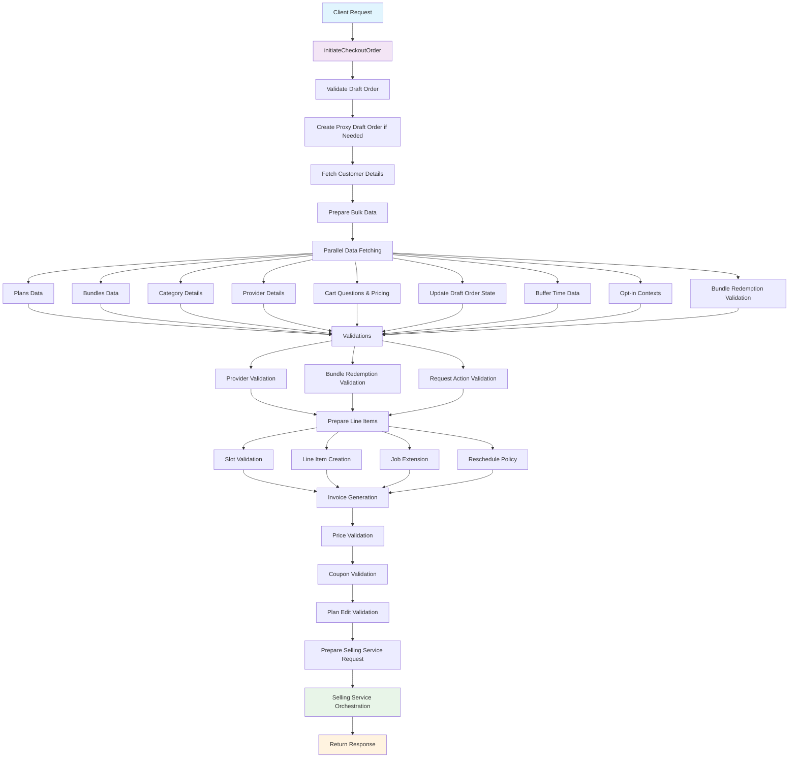

# InitiateCheckoutOrder API Documentation

## Overview

The `initiateCheckoutOrder` API is the core entry point that kicks off the selling orchestrator loop in the customer pre-request service. This API orchestrates the entire checkout process, from validating the draft order to creating line items and initiating payment processing through the selling service.

## API Signature

```typescript
async function initiateCheckoutOrder(
  params: InitiateCheckoutOrderRequest
): Promise<InitiateCheckoutOrderResponse>
```

### Input Parameters

```typescript
interface InitiateCheckoutOrderRequest {
  journeyDetails: {
    id: string; // Draft Order ID
  };
  initiatePaymentPayload: InitiatePaymentPayload;
  deviceDetails: Device;
  userId: string;
}
```

### Response

```typescript
interface InitiateCheckoutOrderResponse {
  isJourneyError: boolean;
  journeyErrorType?: string;
  errorPayload?: {
    message: string;
    retryButtonText: string;
  };
  lineItems?: {
    created: string[];
    updated: string[];
    existing: string[];
  };
  sourceContext?: {
    id: string;
    type: string;
  };
  paymentDetails?: {
    status: PAYMENT_STATUS;
    paymentRequirementId?: string;
    failureCode?: string;
    vendorTransactionInfo?: VendorTransactionInfo;
  };
  checkoutOrderId?: string;
}
```

## Architecture Flow



## Detailed Process Flow

### 1. Initial Setup and Validation

**Location**: `src/customer_journey/checkout_order/index.ts:181-220`

```typescript
// Extract parameters
const { journeyDetails: { id: draftOrderId }, deviceDetails, userId, initiatePaymentPayload } = params;

// Create device context
const deviceContext = {
  device_id: deviceDetails.id,
  device_os: deviceDetails.os,
  app_version: deviceDetails.version,
  rn_bundle_version: deviceDetails.rnBundleVersion,
};

// Validate and fetch draft order
const originalDraftOrder = await DraftOrderService.validateAndGetDraftOrderDetailsById({
  draftOrderId,
  userContext: { user_id: new ObjectId(userId) },
  deviceContext: deviceContext,
});

// Create proxy draft order for provider-led flows
const draftOrder = await createProxyDraftOrderIfNeeded(originalDraftOrder);
```

### 2. Customer and Context Preparation

**Location**: `src/customer_journey/checkout_order/index.ts:222-237`

```typescript
// Fetch customer details
const customerId = draftOrder.getUserContext()?.user_id?.toString();
const customerDetails = await CustomerProfileServiceE.getUserDetails(customerId);

// Prepare bulk data for multi-category support
const routinesPlanIdsWithCategories = getPlanIdsFromDraftOrder(draftOrder);
const bundlePlanIdsWithCategories = getBundlePlanIdsFromDraftOrder(draftOrder);
const redeemingBundleLIs = _(getRedeemingOptInLIsFromDO(draftOrder)).values().flatMap().filter(item => !isEmpty(item)).value();
const catQuestionsPricingPayload = getCatQuestionsPricingBulkPayload(draftOrder);
const bufferTimeInMinutesPayload = getBufferTimeInMinutesPayload(draftOrder);
```

### 3. Parallel Data Fetching

**Location**: `src/customer_journey/checkout_order/index.ts:238-267`

The system performs parallel data fetching for optimal performance:

```typescript
const [
  routinesPlanData,
  bundlesPlanData,
  providerCategoryKeysForAddedCategories,
  providersWithPhoneNumber,
  catQuestionsAndPricing,
  updatedDraftOrder,
  bufferTimeInMinutesBulk,
  optInContextsForBundlePurchases,
  redeemableLIsValidation,
] = await Promise.all([
  getPlansData(routinesPlanIdsWithCategories),
  getBundlesPlansData(bundlePlanIdsWithCategories),
  getCategoryDetailsInCityByKeyNamesBulk(categoryKeys, draftOrder.getLocationContext().city_key, "key_name provider_category_keys"),
  originalUserRole === UserRoles.CUSTOMER 
    ? CoreServiceE.bulkGetProviderDetails(customerDetails.phoneNo) 
    : [],
  CartServiceAccessor.getCatQuestionsAndPricingBulk(catQuestionsPricingPayload),
  DraftOrderService.updateStateofDraftOrderForCheckoutOrder({
    draftOrderId: draftOrder.getId().toString(),
    state: PreRequestState.PAYMENT_INITIATED,
  }),
  getBufferTimeInMinutesBulk(bufferTimeInMinutesPayload),
  getOptInContextForBundlePurchasesAndVariantMap(draftOrder),
  !isPaymentOptionsCalledFromBPR(journeyContext.source, journeyContext.useCase) 
    ? CustomerRepeatProgramServiceE.validateRedeemableLIs(redeemingBundleLIs) 
    : undefined,
]);
```

### 4. Validation Layer

**Location**: `src/customer_journey/checkout_order/index.ts:270-280`

Multiple validation checks are performed:

```typescript
// Validate request actions for post-request flows
validateRequestAction(draftOrder);

// Validate provider placing request in own category
validateProviderPlacingRequestInOwnCategory(providersWithPhoneNumber, providerCategoryKeysForAddedCategories);

// Validate bundle redemption
validateBundleRedemption(redeemableLIsValidation);
```

### 5. Line Item Creation

**Location**: `src/customer_journey/checkout_order/index.ts:282-298`

```typescript
// Get payment context
const paymentContext = getPaymentPreferencesForLibrary(draftOrder, initiatePaymentPayload);

// Create line items based on source flow
const lineItemsLibraryInput = updatedDraftOrder.getSourceFlow() === SourceFlow.PRE_REQUEST
  ? await getLineItemTransformerInputForPreRequest({ draftOrder: draftOrder, externalInput: { paymentContext } }) 
  : await getLineItemTransformerInputForPostRequest({ draftOrder: draftOrder, externalInput: { paymentContext } });
```

### 6. Slot Validation and Line Item Processing

**Location**: `src/customer_journey/checkout_order/index.ts:300-339`

```typescript
// Prepare slot validation payload
const getValidatedSlotPayload = getValidateSlotBulkRequestPayload({
  userId: customerId,
  device: { /* device details */ },
  draftOrder,
  bulkPlanData,
  providerCategoryKeysForAddedCategories,
  catQuestionsAndPricing,
  bufferTimeInMinutesBulk
});

const isCustomerLedRequestUpsellFlow = journeyContext.useCase === JourneyUseCase.CUSTOMER_LED_REQUEST_UPSELL;

// Parallel processing for slot validation, job extension, line items, and reschedule policy
const [
  getValidatedSlotResponse,
  jobExtensionResponse,
  libraryOutput,
  reschedulePolicy
] = await Promise.all([
  !isCustomerLedRequestUpsellFlow
    ? SlotCapacityServiceE.getValidatedSlotBulk(draftOrder, getValidatedSlotPayload)
    : undefined,
  isCustomerLedRequestUpsellFlow
    ? SlotCapacityServiceE.extendJob(getJobExtensionInput(draftOrder))
    : undefined,
  CoreRequestServicE.getLineItemsForUserPreferences(lineItemsLibraryInput),
  getReschedulePolicyIfApplicable(draftOrder),
]);
```

### 7. Invoice Generation

**Location**: `src/customer_journey/checkout_order/index.ts:350-377`

```typescript
// Prepare invoice request
const invoiceRequestPayload = getInvoicePayload({
  lineItemInput: libraryOutput,
  draftOrder,
  initiatePaymentPayload,
  allowedPaymentIntentsForUsecase: undefined,
  reschedulePolicy,
});

// Generate invoice
const invoiceResponse: GetInvoiceResponse = await SellingServiceE.getInvoice(invoiceRequestPayload);
```

### 8. Final Validations

**Location**: `src/customer_journey/checkout_order/index.ts:379-385`

```typescript
// Calculate and validate payable amounts
const inputPayableAmount = calculateRequestPayableAmount(sourceBreakup);
const invoicePayableAmount = getInvoicePayableAmount(invoiceResponse);

// Perform final validations
validateCouponApplicability(invoiceResponse);
validatePayableAmount(inputPayableAmount, invoicePayableAmount); 
validatePlanEditLineItemCreation(draftOrder, libraryOutput);
```

### 9. Selling Service Orchestration

**Location**: `src/customer_journey/checkout_order/index.ts:387-416`

```typescript
// Prepare request for selling service
const initiateCheckoutOrderReq = getInitiateCheckoutOrderRequest({
  draftOrder,
  initiatePaymentPayload,
  invoice: invoiceResponse,
  libraryOutput,
  bulkPlanData,
  bufferTimeInMinutesBulk,
  optInContextsForBundlePurchases: optInContextsForBundlePurchases.optInContextsForPurchases,
  reschedulePolicy,
});

// Call selling service orchestration
const initiateCheckoutOrderResponse = await SellingServiceE.initiateCheckoutOrder(initiateCheckoutOrderReq);
```

### 10. Response Transformation

**Location**: `src/customer_journey/checkout_order/index.ts:418-434`

```typescript
return {
  isJourneyError: false,
  lineItems: {
    created: getLineItemIdsFromCheckoutOrderResponse(initiateCheckoutOrderResponse.lineItems.created),
    updated: getLineItemIdsFromCheckoutOrderResponse(initiateCheckoutOrderResponse.lineItems.updated),
    existing: getLineItemIdsFromCheckoutOrderResponse(initiateCheckoutOrderResponse.lineItems.existing),
  },
  sourceContext: initiateCheckoutOrderResponse.sourceContext,
  paymentDetails: initiateCheckoutOrderResponse.paymentDetails,
  checkoutOrderId: initiateCheckoutOrderResponse.checkoutOrderId,
};
```

## External Dependencies

### Core Services

1. **DraftOrderService** - Manages draft order lifecycle and validation
2. **CustomerProfileServiceE** - Fetches customer profile information
3. **CoreServiceE** - Provides provider details and category information
4. **CartServiceAccessor** - Handles cart questions and pricing
5. **CoreRequestServicE** - Creates line items for user preferences
6. **SlotCapacityServiceE** - Validates slot availability
7. **SellingServiceE** - Orchestrates the selling process and generates invoices
8. **CustomerRepeatProgramServiceE** - Validates bundle redemption

### Data Models

- **DraftOrderV2** - Core draft order entity
- **LineItemTransformerOutput** - Line item creation output
- **GetInvoiceResponse** - Invoice generation response
- **InitiateCheckoutOrderRequest/Response** - API request/response types

## Error Handling

The API includes comprehensive error handling with different error types:

### Validation Errors
- `ENTITY_NOT_FOUND` - Draft order not found
- `DEVICE_MISMATCH` - Device validation failure
- `UNAUTHORIZED` - User authorization failure
- `PRE_REQUEST_EXPIRED` - Draft order expired

### Business Logic Errors
- `BOOKING_PRICE_UNMATCHED_ERROR` - Price mismatch between input and invoice
- `SLOT_EXPIRY_ERROR` - Selected slot no longer available
- `PROVIDER_SAME_CATEGORY_REQUEST` - Provider placing request in own category
- `COUPON_LIMIT_EXCEEDED` - Coupon usage limit exceeded
- `BOOKKEEPING_FAILURE` - Job extension failure

### Error Wrapper

The API is wrapped with `initiateCheckoutOrderErrorWrapper` that:
1. Catches all errors
2. Updates draft order state to `IN_PROGRESS` on failure
3. Maps errors to user-friendly messages
4. Handles retriable errors with appropriate retry mechanisms
5. Logs errors for debugging

## Key Features

### Multi-Category Support
- Handles multiple service categories in a single request
- Uses bulk operations for optimal performance
- Validates slots across all categories

### Provider Proxy Support
- Supports provider placing requests on behalf of customers
- Creates proxy draft orders when needed
- Maintains proper user context separation

### Flexible Payment Flows
- Supports both pre-request and post-request payment flows
- Handles different payment methods (online, COD, credits)
- Manages payment preferences and contexts

### Comprehensive Validation
- Validates draft order state and user permissions
- Checks slot availability and capacity
- Validates pricing and payment amounts
- Ensures business rule compliance

## Performance Optimizations

1. **Parallel Data Fetching** - Multiple external service calls executed in parallel
2. **Bulk Operations** - Uses bulk APIs for multi-category scenarios
3. **Efficient Caching** - Leverages existing draft order data
4. **Conditional Processing** - Skips unnecessary validations based on flow type

## Monitoring and Logging

The API includes extensive logging at key points:
- Request parameters and draft order details
- Line item creation input/output
- Invoice generation payload and response
- Final selling service request and response
- Error conditions with detailed context

## Security Considerations

1. **User Validation** - Validates user ownership of draft order
2. **Device Validation** - Ensures request comes from authorized device
3. **Provider Validation** - Prevents providers from placing requests in their own categories
4. **State Management** - Maintains proper draft order state transitions
5. **Error Information** - Sanitizes error messages to prevent information leakage

This API serves as the critical entry point for the selling orchestrator, ensuring all business rules are validated and the checkout process is properly initiated through the selling service.
