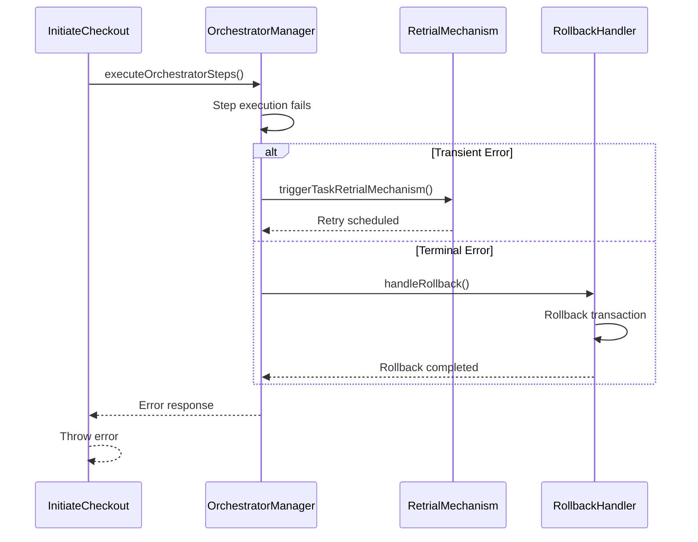
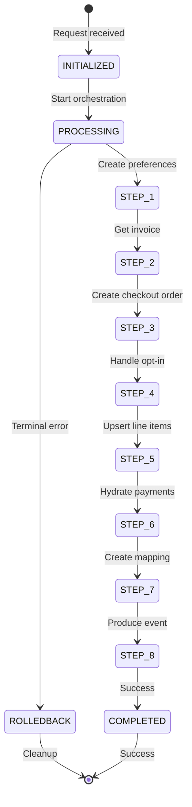
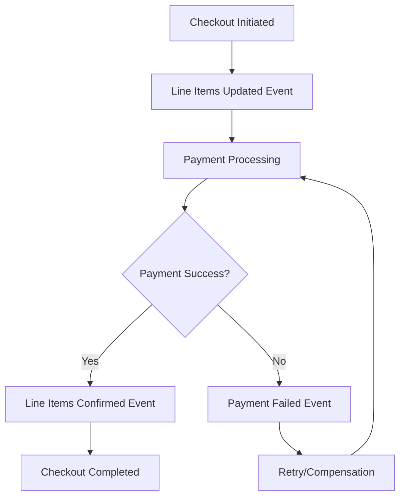

# Checkout Orchestration Sequence Diagram

## Mermaid Sequence Diagram

```mermaid
sequenceDiagram
    participant Client
    participant API as InitiateCheckout.execute
    participant DLM as Distributed Lock Manager
    participant OM as OrchestratorManager
    participant PG as PaymentGroup
    participant PS as PostSellingPreferences
    participant INV as Invoice Engine
    participant CO as CheckoutOrder
    participant OPT as OptIn Service
    participant LI as LineItems
    participant PCR as Payment Requirements
    participant EVT as Event Producer

    Client->>API: POST /orchestration/checkout/initiate
    API->>API: Validate request & get flags
    API->>PG: createPaymentGroup()
    PG-->>API: paymentGroupIds + lineItems
    
    API->>DLM: Acquire locks (executionContextId + paymentGroupIds)
    DLM->>OM: initializeExecutionContext()
    
    Note over OM: Step 1: Create Post-Selling Preferences
    OM->>PS: createPostSellingPreferences()
    PS-->>OM: preferenceIds
    
    Note over OM: Step 2: Get Invoice & Hydrate Pricing
    OM->>INV: getLineItemSummary()
    INV-->>OM: invoice + pricingHydratedLineItems
    
    Note over OM: Step 3: Create Checkout Order
    OM->>CO: createCheckoutOrder()
    CO-->>OM: checkoutOrderId
    
    Note over OM: Step 4: Handle OptIn Creation/Modification
    OM->>OPT: handleOptinCreationAndModification()
    OPT-->>OM: optInIds
    
    Note over OM: Step 5: Upsert Line Items & Create PCR
    OM->>LI: upsertLineItems()
    LI-->>OM: upsertedLineItems
    OM->>PCR: createPaymentRequest()
    PCR-->>OM: paymentCollectionRequirement
    
    Note over OM: Step 6: Hydrate Payments & Update Line Items
    OM->>LI: hydratePaymentAndUpdateLineItems()
    LI-->>OM: updatedLineItems
    
    Note over OM: Step 7: Create Preferences Mapping
    OM->>LI: createPreferencesToLineItemsMapping()
    
    Note over OM: Step 8: Produce Line Items Updated Event
    OM->>EVT: produceLineItemsUpdatedEvent()
    EVT-->>OM: eventPublished
    
    alt PCR Success (Sync)
        Note over OM: Step 9a: Execute PCR Success Steps
        OM->>OM: executePCRSuccessSteps()
        OM->>EVT: produceLineItemsConfirmedEvent()
    else PCR Async
        Note over OM: Step 9b: Wait for PCR Success Event
        Note over PCR: Payment processing...
        PCR->>EVT: payment_collection_requirement_success
        EVT->>OM: handlePCRSuccess()
        OM->>EVT: produceLineItemsConfirmedEvent()
    end
    
    OM-->>API: InitiateCheckoutResponse
    API-->>Client: 200 OK + response
```

## Step-by-Step Breakdown

### Pre-Orchestration Steps
1. **Request Validation**: Validate user, line items, and business rules
2. **Feature Flag Resolution**: Get feature flags based on user, device, and city
3. **Payment Group Creation**: Create payment groups for line items
4. **Distributed Lock Acquisition**: Acquire locks on execution context and payment groups

### Orchestration Steps
1. **Create Post-Selling Preferences**: Create preferences for line items
2. **Get Invoice & Hydrate Pricing**: Get pricing and invoice details
3. **Create Checkout Order**: Create checkout order record
4. **Handle OptIn Creation/Modification**: Create or update opt-ins
5. **Upsert Line Items & Create PCR**: Create/update line items and payment collection requirement
6. **Hydrate Payments & Update Line Items**: Update line items with payment details
7. **Create Preferences Mapping**: Map preferences to line items
8. **Produce Line Items Updated Event**: Publish line items updated event

### Post-Orchestration Steps
9. **Execute PCR Success Steps**: Handle payment success (sync or async)
10. **Produce Line Items Confirmed Event**: Publish line items confirmed event

## Error Handling Flow



## State Transitions



## Event Flow



## Key Components

### OrchestratorManager
- Manages execution context
- Handles step execution
- Provides retry mechanisms
- Manages distributed locking

### ExecutionContext
- Tracks execution state
- Stores step results
- Enables resumability
- Provides audit trail

### Distributed Lock Manager (DLM)
- Prevents concurrent execution
- Manages lock acquisition
- Handles lock timeouts
- Ensures consistency

### Event Producer
- Publishes events
- Handles event failures
- Provides event audit
- Manages event ordering

